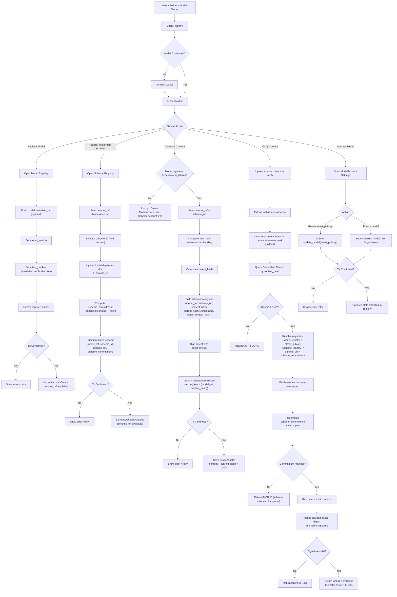

# AI-Generated Content Watermarking and Blockchain-Based Royalty Distribution: A Breakthrough for On-Chain AI Verification

## Abstract

Generative AI models can produce text, images, audio and more at scale – bringing innovative opportunities but also raising issues of content authenticity, copyright ownership, and profit distribution [1, 2]. **AI-generated content watermarking** has emerged as a key technique for embedding hidden markers in AI outputs to facilitate source tracing and model identification [3]. This paper presents a comprehensive overview of current watermarking methods for text, image, and audio content, and proposes using these watermarks to build an **on-chain content provenance system** that traces model usage and content dissemination. On this basis, we design a blockchain-based **royalty distribution mechanism**: by leveraging tamper-proof blockchain records and watermark detection, we enable automatic back-tracing of contributions and revenue sharing across multiple rounds of AI-generated content [4, 5, 6]. We detail watermark embedding techniques, robustness and anti-tampering measures, digital signature integration, blockchain registration, and smart contract structures [7, 8, 9]. We also analyze potential attack vectors and the technical feasibility of the system. Finally, we discuss the scheme's application prospects in the digital content industry, its business significance, and investment value – highlighting that lightweight watermark-based verification could be a breakthrough for bringing AI content on-chain (solving the impracticality of traditional heavy zero-knowledge proofs) and for streamlining royalty computations.


## 1. Introduction

Recent breakthroughs in generative AI (for chat, image synthesis, voice cloning, etc.) have heightened concerns about content authenticity and copyright attribution. On one hand, AI-generated content can be misused for deepfakes and misinformation, eroding public trust in digital media [1]. For example, in 2023 an AI-generated image of Pope Francis in a puffy coat fooled millions of viewers before being revealed as fake [11], and criminals have used AI-cloned voices of company executives to commit fraud [12]. These incidents underscore the risks and societal harm when content provenance is unverified. On the other hand, large generative models are trained on vast internet datasets that include many copyrighted works, sparking an outcry from creators demanding compensation and attribution [2]. Artists and authors have filed lawsuits alleging that AI companies used their works without permission. How to encourage technological innovation while protecting creator rights and ensuring AI-generated content's credibility has become an urgent industry and regulatory question [3].

To address these challenges, the industry has proposed embedding **digital watermarks** in AI-generated content. A **digital watermark** is a hidden identifier embedded imperceptibly into digital content to mark the content's source or owner [3]. Watermarking promises that, without affecting user experience, we can tag AI-generated text, images, audio, etc. with an invisible signature that is machine-detectable. In combination with distributed ledger (blockchain) technology, these watermark identifiers can be linked to on-chain content credentials (e.g. generator ID, timestamps, copyright info), creating an end-to-end content provenance framework [7, 13]. As AI-generated content spreads online, anyone can extract the watermark and check the blockchain record to verify who (or which model) produced the content and through what transformations it has passed.

Going further, blockchain smart contracts enable automated royalty-sharing. Whenever AI-generated content is re-used, remixed, or commercially exploited, a smart contract can, based on the on-chain provenance graph and preset profit-sharing rules, automatically allocate revenue to relevant contributors (such as original data creators, model developers, downstream editors, etc.) [14, 15]. This mechanism could resolve the current problem where **data providers receive no benefit** from generative AI – instead establishing a healthy AI content ecosystem where value flows back to original creators.

## 2. Technical Background

### 2.1 Digital Watermark Concept and Characteristics

A **digital watermark** is a technology for embedding hidden identifiers into digital content for copyright marking and content authentication [3]. A typical watermark system involves **watermark embedding** and **watermark detection/extraction**. The encoder merges identifier information (e.g. owner ID, content ID) with the original content to produce a watermarked piece; the decoder extracts or verifies the hidden identifier to confirm its source [3,10].

An ideal digital watermark should satisfy:
- **Imperceptibility**: embedding should not cause perceptible quality degradation [16]
- **Robustness**: the watermark should remain detectable even after common transformations (re-compression, cropping, noise, format conversion) [3]. Watermarks are classified as *robust* (survive moderate edits) or *fragile* (destroyed by tiny changes, used to detect tampering)
- **Security**: watermark schemes use secret keys – only those with the key can embed or detect the watermark. Unauthorized attackers should neither easily detect nor remove it without degrading content [17]. A secure watermark should be **unforgeable**: computationally infeasible to create valid watermarked content without the secret key [18]

### 2.2 Watermark vs. Digital Fingerprint

Digital watermarks embed the **same identifier** in all copies of content to label source or copyright. A **digital fingerprint** embeds a **unique hidden ID in each individual copy** to trace which specific copy was leaked [19,20]. Our system focuses on watermarks for source authentication (marking AI outputs with model ID), though the framework could extend to fingerprinting for tracing distribution channels.

### 2.3 Multi-Modal Watermarking Techniques

Digital watermarking is well-established for images and video. Classic methods work by adding imperceptible noise in transform domains (DCT, wavelet) or altering least significant pixel bits [21]. Advanced strategies integrate watermarks into the generative model itself: Wen et al. (2023) propose "Tree-Ring Watermark" for diffusion models that injects a circular interference pattern into initial noise, causing every generated image to carry a hidden spectral pattern [22]. Other approaches root watermarks directly in the latent diffusion models [23] or propose recipes for watermarking diffusion models [24].

For audio watermarks, techniques leverage human hearing masking effects, embedding signals in less audible frequency ranges or using phase modulation [25]. For text watermarking, sophisticated approaches bias language model word choices to encode statistical patterns – Kirchenbauer et al. (2023) pioneered a method using a secret key to designate "green-list" words, nudging the model to prefer them such that the distribution reveals a hidden signature [26, 27]. Google DeepMind's SynthID-Text similarly acts as a logits processor [28, 29]. Text watermarks face fragility challenges: paraphrasing can disrupt statistical markers [27].

### 2.4 New Developments in Watermarking

Recent advances apply deep learning to watermarking, enabling end-to-end optimization of encoder-decoder pairs for embedding and detection after distortions [3]. Google's SynthID [16, 28] and Meta's VideoSeal [30] use neural networks to encode signatures directly into content imperceptibly, withstanding blurring, cropping, re-encoding [16]. These are trained adversarially: watermarked content undergoes simulated attacks, and the decoder learns to still extract the watermark. Gunn et al. (2024) propose using pseudo-random error-correcting codes in diffusion model latent space to embed encrypted signatures across semantic levels, making watermarks undetectable without the key [31, 32]. There are even methods emerging for universal watermarking across different image resolutions [33].

Another research line focuses on anti-forgery and public verification. Liu et al. (2024) propose "unforgeable and publicly verifiable watermarks for LLMs" by separating generation and detection with different keys, leveraging cryptographic principles to provide security guarantees [17, 18]. Other work focuses on semantic-invariant watermarks robust to paraphrasing [34, 35]. These approaches aim for reliable and trustworthy watermarking with provable security properties [32, 36]. However, some research also highlights that invisible image watermarks may be provably removable with generative AI [37].

## 3. Watermark Techniques and Properties

Having covered the general concepts, we now examine current mainstream watermarking methods for different content modalities and compare their properties, laying the groundwork for our on-chain system design.

### 3.1 Text Watermark

Watermarking AI-generated text embeds barely perceptible patterns in LLM outputs. Two primary approaches:

**(a) Invisible character embedding**: inserting zero-width Unicode characters to encode information. Simple but easily removed, so robustness is low.

**(b) Probability distribution encoding**:  tweaking word selection to imprint a statistical signature. OpenAI's prototype uses a secret key to classify vocabulary into "green" and "red" lists, biasing toward green-list words [26, 27, 38]. This is invisible to readers and maintains fluency. However, text watermarks are **fragile**: paraphrasing or regeneration can destroy the signal [27]. Research to improve robustness includes larger n-gram patterns or syntactic watermarking, but there's a trade-off between detection reliability and vulnerability to removal. Google's DeepMind has integrated SynthID-Text into Gemini [28, 39], and OpenAI has hinted at watermarking [40, 41]. More robust schemes with cryptographic assurances [18, 34] and open-source toolkits [42] are anticipated.

### 3.2 Image Watermark

Digital watermarking is most established for images. Traditional methods embed watermarks in frequency domains (DCT coefficients, LSB flips) [21]. Learning-based approaches now dominate: generative models are augmented so **every generated image contains a hidden watermark by design**. Google's **SynthID** adds an invisible, hard-to-remove pattern that doesn't affect image quality but remains detectable after cropping, re-scaling, or filters [16]. SynthID uses adversarial training to ensure robustness [28]. The system relies on secure keys rather than algorithm secrecy – even knowing the algorithm, attackers without the key cannot forge or erase the watermark without damaging the image [17]. Other novel methods include dynamic watermarks [43] and "tree-ring" watermarks [22].

**Video watermarking** extends image techniques. Meta's **VideoSeal** embeds signatures across video frames using deep learning, optimized for video-specific distortions (compression, frame rate changes) [30]. It achieves robust detection even with cropping or dropped frames by leveraging temporal redundancy.

### 3.3 Audio Watermark

Audio watermarking leverages human hearing **masking effects**: modifications in ranges where louder audio dominates go unnoticed. Common methods include adding low-level broadband noise shaped to the audio spectrum, introducing faint echoes, or tweaking phase [25]. A robust audio watermark should withstand re-sampling, **lossy compression** (MP3/AAC), ambient noise, and speed/pitch adjustments. Advanced schemes use **spread spectrum** signals – pseudorandom sequences spanning wide frequency ranges at low power, requiring destruction of large audio portions to remove [21]. Error-correcting codes help recover messages even with partial loss. The human ear's sensitivity requires extreme subtlety – poorly implemented watermarks creating audible artifacts are unacceptable. Recent developments include watermarking integrated with AI **vocoders** or speech synthesizers, constraining the model's output layer to produce watermarked audio from the start, potentially yielding more hidden yet resilient marks.

### 3.4 Multi-Modal & Metadata Watermark

Beyond altering content signals, methods based on metadata exist. The **C2PA standard (Coalition for Content Provenance and Authenticity)** allows producers to attach cryptographic metadata "credentials" to files, recording creator, editing history, or AI-generation status. This has **zero quality impact** but metadata can be easily stripped. A practical strategy **combines invisible watermarks with metadata signatures**: the watermark serves as a hidden backup, while metadata provides a convenient provenance trail. Numbers Protocol creates a hash "fingerprint" registered on-chain plus C2PA metadata; if metadata is stripped, the hash or watermark can still match against the blockchain [13].

A watermark serves as a **content-level ID tag**, while blockchain serves as an **immutable registry**. This multi-pronged strategy provides defense in depth.


## 4. On-Chain Provenance User Flow

Figure 1 illustrates the end-to-end user flow for registering model and watermark scheme entries, generating watermarked content, writing a Generation Record on-chain, and verifying provenance using both registry resolution and signature/detection checks.





```
┌─────────────────────────────────────────────────────────────────────┐
│                    AI-GENERATED CONTENT PROVENANCE SYSTEM           │
└─────────────────────────────────────────────────────────────────────┘

STEP 1: CONTENT GENERATION & WATERMARKING
┌──────────────────┐
│  AI Model /      │
│  Creator         │───────┐
└──────────────────┘       │
                           ▼
                    ┌─────────────────────┐
                    │  Generate Content   │
                    │  with Embedded      │
                    │  Watermark ID       │
                    └──────────┬──────────┘
                               │
                               ▼
STEP 2: BLOCKCHAIN REGISTRATION
                    ┌─────────────────────┐
                    │  Register Content   │
                    │  ID & Metadata      │
                    │  on Blockchain      │
                    │  (Provenance Record)│
                    └──────────┬──────────┘
                               │
                               ▼
STEP 3: CONTENT DISTRIBUTION
                    ┌─────────────────────┐
                    │  Content Shared/    │
                    │  Published to       │
                    │  Users/Platforms    │
                    └──────────┬──────────┘
                               │
                               ▼
STEP 4: PROVENANCE VERIFICATION
                    ┌─────────────────────┐
                    │  Extract Watermark  │
                    │  ID from Content    │
                    └──────────┬──────────┘
                               │
                               ▼
                    ┌─────────────────────┐
                    │  Query Blockchain   │
                    │  using Content ID   │
                    └──────────┬──────────┘
                               │
                               ▼
                    ┌─────────────────────┐
                    │  Return Source &    │
                    │  History Info       │
                    │  (Model, Creator,   │
                    │  Timestamp, etc.)   │
                    └──────────┬──────────┘
                               │
                               ▼
                    ┌─────────────────────┐
                    │  Display Provenance │
                    │  & Attributions     │
                    └─────────────────────┘

STEP 5: DERIVATIVE CREATION (Optional)
┌──────────────────┐
│  Derivative      │
│  Content Input   │───────┐
└──────────────────┘       │
                           ▼
                    ┌─────────────────────┐
                    │  New AI Model/      │
                    │  Editor Generates   │
                    │  Derivative         │
                    └──────────┬──────────┘
                               │
                               ▼
                    ┌─────────────────────┐
                    │  Embed New          │
                    │  Watermark ID       │
                    │  (links to parent)  │
                    └──────────┬──────────┘
                               │
                               ▼
                    ┌─────────────────────┐
                    │  Register New ID    │
                    │  with parent        │
                    │  reference on       │
                    │  Blockchain         │
                    └─────────────────────┘

┌─────────────────────────────────────────────────────────────────────┐
│              ROYALTY DISTRIBUTION (Smart Contract)                  │
│                                                                     │
│  When content generates revenue (sale, licensing, ad revenue):      │
│  1. Smart contract reads provenance graph from blockchain           │
│  2. Calculates royalty splits based on recorded percentages         │
│  3. Automatically distributes payments to all contributors          │
│     (original creator → intermediate editors → current owner)       │
└─────────────────────────────────────────────────────────────────────┘
```

**Figure 1: Architecture of the watermark-based on-chain content provenance system.** When a generative AI model produces content, it embeds a watermark containing a unique content identifier (ID). That ID, along with relevant metadata, is immediately recorded on the blockchain (provenance registration). If the content is later edited or used to create new content, the new AI (or user) preserves the original watermark or embeds a new one, and links the new content's record on-chain to its source. When the content is disseminated to end-users or platforms, anyone can extract the watermark ID and query the blockchain to retrieve the content's origin, its full creation history, and associated rights information. This enables verification of source and tracking of derivative lineage through immutable records. Smart contracts can then use the on-chain records to automate royalty settlements based on the provenance graph.

### 4.1 Provenance Registration & Watermark Embedding
This section presents a verifiable provenance registration and watermark-embedding workflow that links detectable watermark signals in content with auditable origin claims. We first introduce three foundational components: a Model Registry to establish model identity and attestation keys; a Watermark Scheme Registry to publish reproducible detection rules along with an integrity anchor; and Generation Records to persist each generation claim as an on-chain fact that is queryable and indexable. We then define a canonical attestation message format so that verifiers can reconstruct the same message and validate signature consistency. Finally, we provide an end-to-end workflow describing how the generation side produces, embeds, and registers content, and how the verification side queries records, validates parameters, and completes detection and signature verification.

#### 4.1.1 Model Registry (ModelAccount)

The Model Registry turns “model identity” into an on-chain anchor that can be publicly verified: it declares the model’s `owner` (who is authorized to publish attestations on behalf of the model) and provides an `attest_pubkey` for generation proofs (the public key verifiers use to validate signatures). It also serves as a unified entry point for querying model metadata and versioning information.

In other words, any verifiable claim of the form “this content comes from this model” must be traceable to a specific ModelAccount; verifiers must also be able to retrieve the correct verification key (`attest_pubkey`) from that ModelAccount.

##### Data Model (recommended minimal field set)

A ModelAccount SHOULD include at least the following fields (a chain-agnostic abstraction; implementations on different chains may map this to account/contract storage):

- `owner`: the model owner address (for access control).
- `attest_pubkey`: the model’s attestation public key, used exclusively for signing/verifying the “attestation payload.”
- `metadata_uri`: a metadata endpoint for the model (e.g., model name, description, weight hash, training data disclosure, server-side attestation policy).
- `model_version`: a model version identifier (recommended as a weight hash or a semantic-version hash).
- `flags`: status flags (at minimum: updatable, frozen, disabled).

##### Addressing / Identity

To make model identity deterministically locatable, a derivable address is recommended (e.g., PDA / CREATE2). The Solana draft suggests representing ModelAccount as a PDA:

`PDA("wm:model", owner_pubkey, model_id_or_version)`

where `model_id_or_version` can be a weight hash, a semantic-version hash, or a project-defined `model_id` hash.

**Normative requirement:**
- Implementations compatible with this standard SHOULD provide stable and reproducible addressing for model identities to enable third-party indexing and verification (rather than relying solely on off-chain databases).

##### Lifecycle and Operations (registration, update, freeze)

**Registration (`register_model`)**  
Create and register a model identity, binding `owner / attest_pubkey / metadata_uri / model_version / flags`, etc.

- `attest_pubkey` MUST be a valid length (32 bytes).
- `metadata_uri` SHOULD have an upper length bound to reduce DoS risk.

**Update and Key Rotation (`update_model`, optional but strongly recommended)**  
The model owner may update model information: rotate the attestation public key (key rotation), update metadata, and update flags (e.g., freezing).

**Normative requirements:**
- `owner` MUST be the only entity authorized to update `attest_pubkey / metadata_uri` (and only when `flags` allow updates).
- Key rotation (rotating `attest_pubkey`) SHOULD be supported to handle realistic operational needs such as key compromise, service migration, and hardware rotation.
- To ensure auditability, the effective activation time of a rotated `attest_pubkey` SHOULD be defined by on-chain state transitions (e.g., the confirmation time/height of the update transaction), rather than relying on off-chain announcements.

**Freeze (immutability)**  
When a model intends to enter an immutable state, the owner SHOULD set flags to frozen; after freezing, updates to critical fields MUST NOT be allowed (at minimum: `attest_pubkey / metadata_uri / model_version`). The update operation should explicitly reject attempts to modify critical fields of a frozen model (e.g., returning `ModelFrozen`).

##### Why `attest_pubkey` must be bound to ModelAccount

In the signature-based proof path, on-chain verification MUST use `ModelAccount.attest_pubkey` to verify the standardized payload. Therefore, ModelAccount is the only entry point answering: “who is authorized to make verifiable claims about generated content, and which public key should be used to verify them?”

To avoid implementation divergence, the proof message should reference the ModelAccount address rather than substituting `attest_pubkey / owner / model_version` (otherwise cross-implementation verification can fail).

##### Practical Notes (optional)

- **Server-side key binding**: `attest_pubkey` SHOULD be bound to the model’s server-side signing system (e.g., the inference service signs at generation time), rather than allowing arbitrary client-side signing, to reduce “forged model claims.”
- **Disabled status**: `flags` may include a “disabled” bit for unified ecosystem handling when a model is revoked or violates policies (preserving historical records while surfacing risk signals).

**Summary:** This section covers model identity, owner, attestation key, versioning, key rotation, and freezing.  
**Purpose:** Answer “who is authorized to make verifiable claims about generated content, and which public key should be used to verify signatures.”

---

#### 4.1.2 Watermark Scheme Registry (WatermarkSchemeRegistry / WatermarkSchemeAccount)

##### Purpose

In open ecosystems, merely stating “a model uses watermark scheme X” is insufficient for verifiable provenance. Verifiability depends on reproducibility: independent verifiers must be able to determine (i) the watermark scheme and version in use, (ii) the parameters and configuration required for detection, and (iii) that these parameters have not been swapped after the fact. To achieve this, we introduce a Watermark Scheme Registry: an on-chain registry entry that binds a model to its watermark scheme and provides a verifiable integrity anchor for detection rules.

##### What a scheme entry represents

A scheme entry represents a “reproducible detection definition.” It answers the verifier’s core question: “Which detector should I run, and with what parameters, to obtain results that are comparable to the generator’s claim?”

Accordingly, each scheme entry SHOULD include at least the following fields:

- `model_ref`: a unique reference to the model identity entry (see 4.1.1).
- `scheme_id`: the watermark scheme identifier.
- `params_uri`: a machine-readable parameter document endpoint, used to retrieve detection configuration and reproduction details.
- `scheme_commitment`: a cryptographic commitment to the detection definition (fixed length, recommended 32 bytes), used to validate that the parameter document has not been tampered with or replaced.
- `status_flags` (optional): e.g., active / deprecated / revoked, for operational status.
- `created_at` (optional): time information for audit/indexing (or derivable from events/block height).

##### `scheme_commitment`: what it commits to and how it is computed

**Design principle:** `scheme_commitment` must commit to all information necessary for a verifier to reproduce detection. Recommended committed content includes at least:

- `scheme_id` (scheme and version)
- `detector_spec` (detector name, implementation version/identifier, output semantics)
- `params` (thresholds, windows, error-correction configuration, and all detection-related parameters)
- `key_commitment` (if keys/seeds are involved, do not reveal the key material directly, but commit to its version or hash)
- `compatibility` (supported media types and preprocessing rules, e.g., image/video/audio/text)

To prevent inconsistent commitments across implementations, the parameter document must undergo deterministic canonical serialization. A recommended framework is:

- `params_bytes = canonical_serialize(params_document)`
- `scheme_commitment = H(domain_tag || model_ref || scheme_id || params_bytes)`

Where:
- `canonical_serialize(·)` is a deterministic serialization procedure specified by the protocol (e.g., canonical JSON: sorted keys, UTF-8, fixed numeric formatting, no redundant whitespace).
- `H(·)` is the protocol-selected fixed hash function.
- `domain_tag` is a fixed domain-separation tag to prevent cross-purpose replay and commitment-domain confusion.

The key point is not that the hash function “prefers” a particular chain; rather, any implementation (on any chain, off-chain service, or client) can compute the same commitment value offline.

##### Binding between scheme and model, and authorization semantics

To avoid naming collisions and impersonation, scheme entries must be explicitly bound to model identity entries:

- The creator/updater of a scheme entry must have administrative permission over the corresponding `model_ref` (equivalent to model owner authority).
- During verification, a verifier should check that the `scheme_ref` referenced by the generation claim (or the scheme entry) is consistent with the `model_ref` binding, i.e., `scheme.model_ref == generation.model_ref`.

This binding lets verifiers complete consistency checks purely via references, without trusting off-chain narratives.

##### Versioning strategy: upgrades without breaking historical verifiability

Watermark systems may evolve due to detector upgrades, parameter tuning, or key rotation. To keep historical content verifiable, we recommend append-only versioning:

- Once registered, `scheme_commitment` SHOULD be treated as immutable.
- Upgrades SHOULD be expressed by creating a new scheme entry (e.g., adding a version suffix to `scheme_id`).
- Old versions SHOULD remain queryable to support historical verification.
- Deprecation/revocation SHOULD be expressed via `status_flags`, without deleting or mutating committed content.

##### Verifier workflow (reproducible steps)

Given a scheme entry referenced by a generation claim, the verifier SHOULD:

1. Retrieve `params_uri` and `scheme_commitment` from the scheme entry.
2. Download the parameter document from `params_uri`, run `canonical_serialize`, and recompute the commitment.
3. If the recomputed commitment differs from `scheme_commitment`, conclude the definition is inconsistent (tampered/replaced) and reject.
4. Otherwise, run watermark detection using the detector and parameters specified in the document, then proceed to the subsequent generation-claim verification steps.

---

#### 4.1.3 Attestation Message Format

##### Purpose

Watermark detection alone provides evidence that “some recognizable signal exists in the content.” To elevate that evidence into an auditable provenance claim, we require a verifiable attestation message: it packages the key facts of a generation event (content hash, model reference, scheme reference, time, and context) into a deterministic message and is signed using the model’s attestation key. Verifiers can reconstruct the same message and verify the signature, obtaining consistent results across platforms and implementations.

The key is not “which chain performs verification,” but that all implementations produce the exact same message byte string for the same claim. This section therefore defines a canonical message schema and encoding rules to ensure interoperability.

##### 1. What the message contains (Normative Schema)

An attestation message (denoted `M`) SHOULD include at least:

- `domain_tag`: fixed domain-separation label (prevent cross-protocol/cross-purpose replay)
- `schema_version`: message schema version
- `model_ref`: unique reference to the model identity entry (see 4.1.1)
- `scheme_ref`: unique reference to the watermark scheme entry (see 4.1.2)
- `content_hash`: hash of the generated content (see content hash section)
- `parent_hash`: parent content hash (all zeros if none)
- `timestamp`: attestation time (Unix seconds, or another deterministic time format)
- `nonce`: random or deterministic nonce (prevent collisions/repeats in the same context)
- `context_hash` (optional): commitment to additional context (e.g., prompt/seed/runtime parameters/license terms stored off-chain)

**Design principles:**
- `model_ref` and `scheme_ref` must appear as references to registry entries rather than being replaced by `owner`, `pubkey`, or string names, so verifiers can retrieve verification keys and detection parameters from registries and avoid implementation divergence.
- `content_hash` anchors the content; `model_ref/scheme_ref` anchor identity and detection definition. Together they constitute a verifiable provenance assertion.

##### 2. Canonical Encoding: converting fields into a unique byte string

To ensure cross-chain and cross-language consistency, the attestation message must use deterministic encoding to produce `payload_bytes`. We recommend a simple “length prefix + fixed endianness” encoding to avoid dependence on chain-specific ABIs or serialization libraries.

###### 2.1 Field type conventions

- `bytes32`: fixed 32 bytes
- `u8 / u16 / u64`: unsigned integers; endianness (little-endian or big-endian) must be fixed by the protocol (choose one globally)
- `string`: UTF-8 bytes, with a `u16` or `u32` length prefix
- `ref` (`model_ref/scheme_ref`): an abstract protocol type encoded as `ref_type + ref_bytes`
  - `ref_type`: `u8`, indicates reference kind (e.g., 0=bytes32 id, 1=32-byte key, 2=hash-of-uri)
  - `ref_bytes`: length prefix + bytes

This approach avoids hardcoding references as chain-specific address types while remaining unambiguous and extensible.

###### Recommended encoding (example)

```text
payload_bytes =
  domain_tag_len(u8) || domain_tag(bytes) ||
  schema_version(u8) ||
  encode_ref(model_ref) ||
  encode_ref(scheme_ref) ||
  content_hash(32) ||
  parent_hash(32) ||
  timestamp(u64) ||
  nonce(32) ||
  context_hash_present(u8) || [context_hash(32)]?

encode_ref(ref) =
  ref_type(u8) ||
  ref_len(u16) ||
  ref_bytes(ref_len)
```

**Normative requirements:**

- `domain_tag` MUST be a protocol-defined constant (e.g., `"WM_PROV_V1"`) to achieve domain separation.
- All integer fields MUST use the protocol-defined endianness (LE or BE); implementations must not choose independently.
- Strings MUST use UTF-8 and MUST use length prefixes (no NUL termination or other non-deterministic forms).
- `parent_hash` MUST be 32 bytes of zeros when there is no parent, to avoid “null/empty” divergence.
- `context_hash_present` MUST explicitly indicate presence/absence of the optional field to avoid ambiguity between “missing” and “all zeros.”

##### 3. Signature input and verification rules

###### 3.1 Message-to-sign

To prevent signatures over the same payload from being reused in different contexts, the signature input should bind to the digest of `payload_bytes`:

- `digest = H(payload_bytes)`
- `signature = Sign(attest_privkey, digest)`

Here, `H(·)` is a protocol-fixed hash function (as in Section 4.1.2, the key is consistency and determinism), and `Sign` is a signature algorithm chosen by the implementation but must match the public key type declared in the Model Registry.

###### 3.2 Source of verification key

Verifiers MUST obtain the model’s attestation public key or signer identity (e.g., `attest_pubkey` or equivalent) from the Model Registry entry and use it to verify the attestation message signature.

This rule provides the trust root: who can speak for the model is constrained by the Model Registry’s owner and attestation key, rather than by arbitrary submitter claims.

##### 4. How verifiers reconstruct and validate (implementable flow)

Given content and its on-chain/off-chain claim, verifiers:

1. Compute/obtain `content_hash`.
2. Obtain `model_ref` and `scheme_ref` from the claim.
3. Read the corresponding registry entries (model entry for verification identity; scheme entry for detection parameters and commitment check).
4. Rebuild `payload_bytes` per this section.
5. Compute `digest = H(payload_bytes)`.
6. Verify `signature` using the model’s attestation public key.
7. If signature verification passes and `scheme_ref` is bound to the same `model_ref`, the provenance claim holds (combined with watermark detection results, this yields “content contains the scheme’s watermark + model-signed claim is consistent” as complementary evidence).

##### 5. (Strongly recommended) test vector template (for interoperability)

To avoid inconsistent interpretation of encoding details, we recommend publishing at least one public test vector per `schema_version`. Each vector includes:

**Inputs (JSON)**

- `domain_tag`
- `schema_version`
- `model_ref` (including `ref_type` and `ref_bytes` in hex)
- `scheme_ref`
- `content_hash`
- `parent_hash`
- `timestamp`
- `nonce`
- `context_hash_present` and `context_hash` (if any)

**Expected outputs**

- `payload_bytes_hex`
- `digest_hex`
- `signature_hex` (optionally per signature algorithm, or generated via a reference implementation in the repo)

With test vectors, EVM teams, Solana teams, and third-party clients can align on identical `payload_bytes` and `digest` for the same inputs, ensuring consistent verification across ecosystems.

---

#### 4.1.4 Generation Record

##### Purpose

A Generation Record anchors a signed generation proof (attestation) as a queryable, indexable, auditable on-chain fact. Unlike the attestation message in Section 4.1.3, Generation Records emphasize persistence and retrieval: they allow verifiers to quickly locate provenance data by `content_hash` (and optionally `model_ref`), and reconstruct the attestation payload to verify signature consistency when needed.

Design goals include:

- **Queryable**: records can be located via content hash.
- **Unambiguous**: the same content/model relationship cannot conflict or be overwritten.
- **Traceable**: supports lineage through parent linkage.
- **Operable**: includes clear error semantics and constraints to mitigate abuse.

##### 5. Record Key and Uniqueness Domain

A Generation Record must define a unique key (`record_key`) to determine whether “the same record already exists.” Recommended options:

- **Recommended (most common):** `record_key = (model_ref, content_hash)`  
  Rationale: the same content hash could (in rare cases) occur under different models; using `(model_ref, content_hash)` avoids cross-model conflicts and aligns with the semantics that the model is accountable for its outputs.
- **Optional (stricter):** `record_key = (content_hash)`  
  Rationale: global uniqueness, suitable if you require a single authoritative registration for any content, but this increases governance and dispute complexity.

**Normative requirements:**

- For any chosen uniqueness domain, the system MUST reject creation of duplicate Generation Records with the same `record_key` (prevent overwrites and replays).
- If the protocol allows “updates,” it MUST use explicit append-only revisioning and keep old versions queryable; silent overwriting is not allowed.

##### 2. Data model (recommended minimal field set)

Each Generation Record SHOULD include at least:

- `model_ref`: model identity reference (consistent with Section 4.1.3)
- `scheme_ref`: watermark scheme reference (consistent with Section 4.1.3 and must bind to the same `model_ref`)
- `content_hash`: content hash for the artifact
- `parent_hash`: parent content hash (all zeros if none)
- `timestamp`: attestation time
- `nonce`: the nonce used in the attestation message
- `signature`: signature over the attestation digest defined in Section 4.1.3
- `payload_digest` (optional but recommended): `H(payload_bytes)` for fast alignment and indexing
- `context_hash` (optional): off-chain context commitment (if enabled in Section 4.1.3)

**Critical consistency constraint:**

- Stored fields MUST be sufficient for verifiers to reconstruct the Section 4.1.3 `payload_bytes` (or at least its digest); otherwise, third parties cannot independently verify signatures.

##### 3. `parent_hash`: semantics and constraints for lineage

`parent_hash` expresses lineage relationships. To avoid ambiguity and implementation divergence:

- If the content is not derived, `parent_hash` MUST be 32 bytes of zeros.
- If the content has a parent, `parent_hash` MUST equal the parent’s `content_hash` (the parent’s content anchor).

Optional strengthening (depending on product requirements):

- The system MAY require the parent content to already have a Generation Record (i.e., parent must be resolvable to on-chain provenance), otherwise reject registration.
- Alternatively, it may allow referencing an unregistered parent, but UI should mark it as “not fully traceable.”

##### 4. Consistency check between scheme and model

The referenced `scheme_ref` must be consistent with `model_ref`:

- The scheme’s bound `model_ref` MUST equal the `model_ref` in the Generation Record.
- If inconsistent, the system MUST reject the record (prevent “using someone else’s scheme to impersonate this model” or mixing parameters under the same scheme name).

##### 5. How verifiers use Generation Records (minimal implementable path)

Given content, a verifier typically:

1. Compute `content_hash`.
2. Query Generation Records by `content_hash` (or `(model_ref, content_hash)` if model is known).
3. Extract `model_ref / scheme_ref / timestamp / nonce / signature`.
4. Rebuild `payload_bytes` and `digest` per Section 4.1.3.
5. Fetch verification identity from Model Registry and verify `signature`.
6. Fetch parameters from Scheme Registry, validate `scheme_commitment`, then run watermark detection as content-side evidence.
7. Output structured results (e.g., `VALID / NOT_FOUND / INVALID_SIG / SCHEME_MISMATCH / PARENT_INVALID`).

##### 6. Error semantics (for implementability)

To ensure consistent failure behavior, we recommend defining at least the following error categories (as error codes/status codes):

- `RecordAlreadyExists`: uniqueness-domain collision (duplicate registration)
- `InvalidSignature`: signature does not verify under the model’s attestation key
- `UnknownModel`: `model_ref` cannot be resolved (model not registered/unavailable)
- `UnknownScheme`: `scheme_ref` cannot be resolved (scheme not registered/unavailable)
- `SchemeModelMismatch`: scheme-model binding mismatch
- `InvalidParentHash`: invalid `parent_hash` (e.g., non-zero but malformed)
- `ParentNotFound` (optional): parent record required but not found
- `InvalidTimestamp` (optional): timestamp outside allowed window (if anti-replay window is enabled)
- `UnsupportedSchemaVersion`: unsupported attestation schema version

These are protocol semantics, not chain features; they can map to revert reasons, program error codes, or event statuses on any chain.

##### 7. Practical notes (optional)

- **Indexability**: provide indexable lookup for `content_hash` and `model_ref` (e.g., event logs or enumerable key spaces) to support third-party indexing services.
- **Anti-abuse**: introduce fees/deposits/rate limits at registration to deter spam; this is a deployment policy and does not change core protocol semantics.
- **Extensibility**: reserve extension fields or attach off-chain extension data via `context_hash` to avoid frequent upgrades of the core schema.

---

#### 4.1.5 End-to-End Workflow (End-to-End Flow)

This section provides an implementable end-to-end workflow, showing how generators produce verifiable watermark provenance records and how verifiers reconstruct and validate the same claim. The workflow relies on three primitives: Model Registry (Section 4.1.1), Scheme Registry (Section 4.1.2), and Generation Records (Section 4.1.4), and uses the standardized attestation message format (Section 4.1.3) as the signing object.

##### A. Preparation: register model and watermark scheme (one-time or low frequency)

**Step A1: Model registration (Model Registry entry creation)**  
The model owner creates a model identity entry and writes:

- `owner`: model administrative entity
- `attest_pubkey` (or equivalent signer identity): for attestation verification
- `model_version`, `metadata_uri`, `flags`, etc.

This step provides the trust root for all subsequent claims: who is authorized to sign on behalf of the model.

**Step A2: Scheme registration (Scheme Registry entry creation)**  
The model owner registers a watermark scheme entry for the model and writes:

- `model_ref` (pointing to the model entry from Step A1)
- `scheme_id`
- `params_uri`
- `scheme_commitment`

`scheme_commitment` commits to the detection definition, ensuring verifiers can detect parameter tampering (see Section 4.1.2).

##### B. Generation: generate content, embed watermark, create attestation, and register record (high frequency)

**Step B1: Generate content and embed watermark**  
The generator produces content using the model and scheme, embedding the watermark during generation. The embedding outcome should allow verifiers to extract evidence matching the scheme via the scheme-defined detector (e.g., scheme payload, confidence).

**Step B2: Compute the content anchor `content_hash`**  
Compute `content_hash = Hash(canonical_bytes(content))` (canonicalization rules are specified by the protocol or constrained by deployment policy). `content_hash` is the content-level anchor for on-chain lookup and integrity alignment.

**Step B3: Determine lineage (optional)**  
If derived content:

- `parent_hash = parent_content_hash`

Otherwise:

- `parent_hash = 0x00…00` (32 bytes all zeros)

**Step B4: Construct standardized attestation payload**  
Construct fields per Section 4.1.3:

- `model_ref`
- `scheme_ref`
- `content_hash`
- `parent_hash`
- `timestamp`
- `nonce`
- `context_hash` (optional)

Encode to `payload_bytes` via canonical encoding, then compute `digest = H(payload_bytes)`.

**Step B5: Sign the attestation**  
Sign `digest` using the model’s attestation private key to obtain `signature`. This signature is the core evidence that “the model is accountable for this generation claim.”

**Step B6: Write the Generation Record (Generation record submission)**  
Submit the Generation Record on-chain (or to an on-chain component), containing at least:

- `model_ref, scheme_ref, content_hash, parent_hash, timestamp, nonce, signature`

And satisfy the uniqueness constraint (e.g., `(model_ref, content_hash)` must not repeat). The system should also validate scheme-model binding consistency and verify the signature under the model’s attestation public key (see Section 4.1.4).

##### C. Verification: reconstruct detection definition, query record, rebuild message, and verify signature (third-party executable)

**Step C1: Obtain content and compute `content_hash`**  
Compute `content_hash` for lookup.

**Step C2: Query Generation Records**  
Query by `content_hash` (or `(model_ref, content_hash)` if the verifier already has a candidate model). If not found, return `NOT_FOUND` (or enter a dispute/backfill flow depending on system design).

**Step C3: Resolve registries and validate the scheme definition**  
Retrieve:

- Model Registry entry: obtain model verification identity
- Scheme Registry entry: obtain `params_uri` and `scheme_commitment`

Download the parameter document, canonicalize and recompute the commitment, and compare to `scheme_commitment`. If inconsistent, reject.

**Step C4: Run watermark detection (content-side evidence)**  
Run the scheme-defined detector and parameters on content to obtain watermark evidence (e.g., confidence, payload). This provides content-side evidence that the watermark matches the scheme.

**Step C5: Rebuild attestation message and verify signature (claim-side evidence)**  
Rebuild `payload_bytes` and `digest` per Section 4.1.3 using fields from the Generation Record, then verify `signature` using the model verification identity. If verification fails, return `INVALID_SIG`.

**Step C6: Output a unified verification conclusion**  
A verifier may conclude the provenance claim holds when all of the following are satisfied:

- Scheme definition integrity holds (commitment matches)
- Watermark detection matches the scheme (content-side evidence)
- Attestation signature verifies (claim-side evidence)
- Scheme-model binding matches and parent rules are satisfied (structural consistency)

Recommended structured output:

- `status` (`VALID / NOT_FOUND / INVALID_SIG / SCHEME_MISMATCH / …`)
- `model_ref, scheme_ref, content_hash, parent_hash, timestamp`
- `evidence` (detection confidence, commitment check result, signature verification result, etc.)


### 4.2 Provenance Query & Verification (Verifier Algorithm)

This section specifies how a verifier validates a piece of content by establishing a consistent verification loop across publicly auditable on-chain state and off-chain parameter documents. The objective is not merely to “read metadata,” but to jointly satisfy three classes of consistency checks: (i) **claim-side consistency** (whether the model has signed the provenance claim), (ii) **definition-side consistency** (whether the detection definition and parameters have been tampered with or swapped), and (iii) **content-side consistency** (whether the content exhibits watermark evidence consistent with the referenced scheme). A verifier SHOULD output **VALID** only when these evidences jointly hold.

#### 4.2.1 Inputs and Preconditions

**Inputs.** At minimum, the verifier requires:

- The target content `content` (as a file or a retrievable URL).
- (Optional) a candidate `model_ref` (provided by UI/indexing layers for lookup acceleration or ambiguity resolution).
- (Optional) a candidate `scheme_ref` (when the expected scheme is already known).

**Preconditions.** The verifier requires:

- Read access to on-chain state for:
  - Model Registry entries (to obtain `attest_pubkey`, `flags`, `model_version`, etc.)
  - Scheme Registry entries (to obtain `params_uri`, `scheme_commitment`, `scheme_id`, and scheme-model binding)
  - Generation Records (to obtain `model_ref`, `scheme_ref`, `content_hash`, `signature`, `timestamp`, `nonce`, etc.)
- Access to the parameter document `params_doc` at `params_uri`, and a deterministic canonical serialization procedure `canonical_serialize(·)`.
- A deployment-defined method for computing `content_hash`. Deployments MAY specify canonicalization rules for certain media types (e.g., stripping metadata or enforcing container normalization). If unspecified, the default is hashing the raw content bytes, while fixing the hash algorithm and byte-order conventions.

> Note: Interoperability depends on deterministic reconstruction. Verifiers MUST be able to reconstruct the same payload encoding, digest, and signature input as generators. In environments where stable byte-level canonicalization is difficult (e.g., cross-platform transcoding), byte-level hash equality SHOULD be treated as an evidence item rather than a single decisive criterion; watermark detection and signed claims provide the primary auditable evidence.

#### 4.2.2 Lookup

The verifier first locates the corresponding on-chain Generation Record for the target content.

1. **Content-side extraction (evidence and/or lookup hint).**  
   The verifier runs scheme-appropriate extraction/detection pre-processing on `content` to obtain watermark-related signals `wm_evidence` (e.g., detected payload fragments, confidence scores, synchronization cues). `wm_evidence` alone does not constitute a provenance conclusion; it provides content-side evidence and may assist record discovery.

2. **Compute or obtain `content_hash`.**  
   The verifier computes `content_hash = Hash(canonical_bytes(content))`. If the deployment uses a “watermark payload → content anchor” mapping strategy, the verifier MAY derive an index key from the embedded payload and then map or validate against `content_hash`. In all cases, the verifier ultimately needs a content anchor usable for on-chain retrieval.

3. **Query the Generation Record.**  
   The verifier queries the Generation Record using one of the following keys:
   - Recommended: `(model_ref, content_hash)` when `model_ref` is known or can be provided as a candidate.
   - Alternative: `content_hash` when the system supports a global uniqueness domain or provides a content-hash index.

If no record is found, the verifier SHOULD return `NOT_FOUND` (and MAY attach optional guidance for backfill/dispute flows depending on product policy). The verifier SHOULD NOT return “INVALID” solely due to `NOT_FOUND`, because this condition may reflect non-registration or indexing lag rather than adversarial forgery.

#### 4.2.3 Resolve and Validate Dependencies

If a Generation Record exists, the verifier MUST resolve and validate referenced registries to establish a reproducible basis for “who signed” and “what detection definition to run.”

1. **Resolve Model Registry (verification identity).**  
   Using `model_ref` from the Generation Record, the verifier reads the corresponding Model Registry entry to obtain `attest_pubkey`. If the Model Registry entry cannot be resolved, return `MODEL_UNKNOWN`.

2. **Resolve Scheme Registry (detection definition).**  
   Using `scheme_ref` from the Generation Record, the verifier reads the corresponding Scheme Registry entry to obtain:
   - `params_uri`
   - `scheme_commitment`
   - `scheme.model_ref` (the scheme-model binding)

   If the Scheme Registry entry cannot be resolved, return `SCHEME_UNKNOWN`.

3. **Validate scheme definition integrity (commitment check).**  
   The verifier fetches `params_doc` from `params_uri`, canonicalizes it via `canonical_serialize(·)` to obtain `params_bytes`, then recomputes:

   `scheme_commitment' = H(domain_tag || model_ref || scheme_id || params_bytes)`  
   (or an equivalent protocol-defined commitment formula)

   and checks `scheme_commitment' == scheme_commitment`.

   If the commitment does not match, the verifier MUST return `SCHEME_MISMATCH` (or the more explicit `SCHEME_TAMPERED`) and stop. Subsequent detection or signature checks are not meaningful if the detection definition is not auditable.

4. **Validate scheme-model binding.**  
   The verifier checks `scheme.model_ref == generation.model_ref`. If not, return `SCHEME_MODEL_MISMATCH`.

#### 4.2.4 Verify the Claim and the Content Evidence

After dependency resolution and definition validation, the verifier separately performs claim-side signature verification and content-side watermark detection, then merges them under a unified decision rule.

1. **Claim-side: reconstruct payload and verify signature.**  
   The verifier extracts required fields from the Generation Record (at least `model_ref`, `scheme_ref`, `content_hash`, `parent_hash`, `timestamp`, `nonce`, and optional `context_hash`), reconstructs `payload_bytes` according to Section 4.1.3, computes `digest = H(payload_bytes)`, and verifies `signature` using `attest_pubkey` from the Model Registry. If signature verification fails, return `INVALID_SIG`.

2. **Content-side: run the detector to obtain watermark evidence.**  
   Using the detector specification and parameters in `params_doc`, the verifier runs watermark detection on `content` and obtains `detect_result` (e.g., `confidence`, recovered payload, error-correction diagnostics). If detection fails or falls below the defined threshold, return `DETECTION_FAILED` (or treat it as an invalidity reason depending on the deployment’s robustness policy).

3. **Final decision rule (recommended).**  
   The verifier returns `VALID` only when all of the following hold:

   - `commitment_verified == true` (scheme definition integrity)
   - `signature_verified == true` (claim-side authenticity)
   - `detection_verified == true` (content-side watermark evidence consistent with the scheme)
   - `binding_verified == true` (scheme-model binding and structural consistency)
   - (If lineage is enabled) `parent_hash` rules are satisfied

#### 4.2.5 Output Schema (Recommended Verification Result)

For platform integration and auditability, verifiers SHOULD return a structured result rather than a boolean. A recommended minimal schema is:

- `status`:
  - `VALID`
  - `NOT_FOUND`
  - `MODEL_UNKNOWN`
  - `SCHEME_UNKNOWN`
  - `SCHEME_MISMATCH` (or `SCHEME_TAMPERED`)
  - `SCHEME_MODEL_MISMATCH`
  - `INVALID_SIG`
  - `DETECTION_FAILED`
  - `UNSUPPORTED_SCHEMA_VERSION` (if schema versioning is enabled)

- `refs`:
  - `model_ref`
  - `scheme_ref`

- `anchors`:
  - `content_hash`
  - `parent_hash` (if applicable)
  - `record_key` (if the system explicitly uses `(model_ref, content_hash)`)

- `evidence`:
  - `commitment_verified: bool`
  - `signature_verified: bool`
  - `detection_verified: bool`
  - `detection_confidence: number` (if applicable)
  - `tx_link` / `record_locator` (on-chain location)
  - (Optional) `payload_digest`, `schema_version`, `timestamp`, `nonce`, `context_hash`

The result SHOULD be sufficient for third parties to reproduce key checks using `refs` and `anchors` without relying on private databases, enabling independent audit of the verifier’s conclusion.

---

### 4.3 Authenticity, Tamper Detection, and Failure Modes

This section discusses failure modes in real-world distribution environments from an adversarial perspective and defines implementable decision semantics. A key principle is that provenance conclusions SHOULD be based on a reproducible **set of evidences**, not a single signal (e.g., hash equality alone or detection alone).

#### 4.3.1 Threat Model (Brief)

The system is expected to address the following threats:

1. **Forged provenance claims**: an adversary presents unwatermarked or third-party content while claiming it originates from a specific model.
2. **Replay and misattribution**: an adversary reuses an old on-chain record or signature to “fit” a different artifact.
3. **Parameter substitution**: an adversary swaps the content of `params_uri` to induce verifiers to run incorrect or permissive detection rules.
4. **Distribution-induced divergence**: transcoding, cropping, and resampling alter byte-level hashes while the semantic content may remain similar and watermarks may or may not survive.
5. **Adversarial tampering**: targeted transformations aim to destroy or desynchronize the watermark while on-chain records still exist.

#### 4.3.2 Decision Matrix

To avoid overclaiming forgery when a single step fails, verifiers SHOULD implement clear decision semantics:

- **`NOT_FOUND`**
  - Meaning: no on-chain Generation Record was found.
  - Interpretation: may indicate non-registration, indexing lag, or out-of-system content; it does not, by itself, prove forgery.
  - Recommendation: return a risk indication and an optional backfill/dispute path.

- **`SCHEME_MISMATCH` (or `SCHEME_TAMPERED`)**
  - Trigger: the `scheme_commitment` check fails.
  - Meaning: the detection definition is not auditable (parameters swapped/tampered), so verification MUST stop.
  - Security value: prevents “passing verification” by changing the detector/parameters post hoc.

- **`INVALID_SIG`**
  - Trigger: signature verification fails under the model’s attestation key.
  - Meaning: the model did not sign the claim; even if watermark-like signals exist, attribution to the model is unsupported.
  - Security value: strongest negative evidence on the claim side.

- **`DETECTION_FAILED` with `signature_verified == true`**
  - Meaning: a model-signed claim exists on-chain, but content-side detection does not validate.
  - Possible causes: strong transcoding/cropping, adversarial watermark removal, or mismatch between the presented file and the claimed artifact.
  - Recommendation: if supported, return an “inconclusive/suspected tampering” outcome (e.g., `INCONCLUSIVE` or `TAMPER_SUSPECT`) and provide evidence for audit.

- **`detection_verified == true` but `signature_verified == false`**
  - Meaning: detectable signals exist, but the model did not sign the corresponding claim.
  - Security value: treat as “watermark evidence without authenticated attribution”; avoid automatic attribution.

- **`VALID`**
  - Trigger: integrity, signature, detection, and binding checks all pass.
  - Output: return `VALID` with the full evidence set and on-chain location for auditability.

#### 4.3.3 The Role and Limitations of Hashes

A byte-level `content_hash` is a strong anchor for precise record lookup and replay resistance: the same hash corresponds to the same declared artifact. However, in real-world distribution, transcoding and container rewrapping change bytes and thus alter the hash. Therefore:

- `content_hash` is best viewed as the anchor for on-chain lookup and signed claims.
- “hash equality” SHOULD be treated as one evidence item rather than the sole decision criterion.
- For broad distribution scenarios, the primary auditable evidence comes from the combination of (i) signature-backed claims, (ii) scheme definition integrity, and (iii) watermark detection evidence.

#### 4.3.4 Optional Dispute and Backfill Policy

For `NOT_FOUND` or `INCONCLUSIVE/TAMPER_SUSPECT` outcomes, deployments MAY provide dispute/backfill mechanisms (e.g., allowing the model owner or platform to submit additional records or risk annotations). Such mechanisms are deployment policy choices and do not alter core verification semantics, but they can substantially reduce operational friction and misclassification costs.


## 5. Rights & Recursive Royalty Settlement

This section builds on the verifiable provenance primitives and verification loop defined in Section 4, and specifies an implementable mechanism for rights assertions and recursive royalty settlement. The core principle is that royalty settlement SHOULD NOT rely on unauditable off-chain narratives (e.g., “a platform claims this content belongs to someone”), but instead SHOULD be anchored to verifiable provenance anchors and reproducible dependency relationships (Model Registry, Scheme Registry, Generation Records, and the standardized attestation payload and signature). Under these constraints, the system can support cross-platform automated payouts and auditable, recursive revenue distribution.

### 5.1 Rights & Royalty Policy Attachment

This subsection defines what a Royalty Policy binds to, who may create/update it, and how to prevent post hoc tampering.

#### 5.1.1 Anchor

A Royalty Policy SHOULD bind to a provenance anchor that uniquely identifies a generation claim. The recommended binding key is:

- `record_key = (model_ref, content_hash)`

where `model_ref` is resolved via the Model Registry and `content_hash` matches the Generation Record. This binding reduces disputes in edge cases where the same `content_hash` could be claimed by different models or entities; including `model_ref` provides domain separation and keeps “who is authorized to claim” consistent with the signature verification path defined in Section 4.

If a deployment uses a global uniqueness domain, a policy MAY bind to `content_hash` alone. In that case, the system MUST explicitly define uniqueness and conflict handling (e.g., first-writer-wins, or append-only versioning that preserves history).

#### 5.1.2 Minimal Data Model

A Royalty Policy, as an auditable on-chain object, SHOULD include at least:

- `record_key`: recommended `(model_ref, content_hash)`; or `content_hash` if a global domain is used.
- `rights_owner`: the authority permitted to create/update/revoke the policy.
- `license_uri`: a human-readable and machine-readable license entrypoint (machine-readable form SHOULD be available for parsing key terms).
- `policy_commitment`: an integrity commitment over the license terms and structured royalty terms, preventing silent substitution of content behind `license_uri`.
- `royalty_terms`: structured terms, including at minimum:
  - `beneficiaries[]`: list of beneficiaries (addresses or resolvable identifiers)
  - `shares_bps[]`: payout shares (basis points)
  - `derivative_royalty_bps`: recursive rate applied to derivatives (bps)
  - `max_depth`: maximum recursion depth (to prevent unbounded traversal / DoS)
  - `total_royalty_cap_bps` (optional): cap on total royalty extraction
- `status_flags`: state flags (active / deprecated / revoked, etc.)
- `created_at` / `updated_at` (optional): for auditing and indexing (or derived from on-chain events/block time)

`policy_commitment` SHOULD follow the same “canonicalize then hash” pattern used by the Scheme Registry, so third parties can reproduce it deterministically. For example:

- `policy_bytes = canonical_serialize(license_terms || royalty_terms)`
- `policy_commitment = H(domain_tag || record_key || policy_bytes)`

This allows verifiers to determine whether the license terms were swapped, without trusting `license_uri`.

#### 5.1.3 Authorization & Update Semantics

To support real-world operations while preserving auditability:

- Only `rights_owner` MAY create, update, or revoke a policy.
- If a policy is marked `frozen` (optional flag), key fields (at least `policy_commitment` and `royalty_terms`) MUST NOT be modified.
- If updates are allowed, they SHOULD be append-only and versioned: create a new policy version while keeping prior versions queryable, so historical settlements remain reproducible and disputes remain traceable.

#### 5.1.4 Linking to Attestation Context

To cryptographically bind a generation claim to its rights terms, deployments SHOULD use the `context_hash` field in the attestation payload (Section 4) to commit to policy information, e.g.:

- `context_hash = H(policy_commitment || optional_context…)`

This tightens the evidence chain between Generation Records and rights policies and reduces disputes where the content behind `license_uri` becomes unavailable or is silently replaced.

---

### 5.2 Royalty Computation Model

This subsection turns “recursive royalty distribution” into an implementable set of rules, making traversal paths, aggregation semantics, and boundary behavior explicit.

#### 5.2.1 Lineage Traversal

The system treats Generation Records as the authoritative provenance facts and uses `parent_hash` to represent derivation. Royalty computation starts at the current content’s Generation Record and traverses upstream under the following rules:

- If `parent_hash` is all zeros, there is no parent and recursion terminates.
- If `parent_hash` is non-zero, attempt to locate the parent’s Generation Record and continue traversal until:
  - an all-zero parent is reached, or
  - `max_depth` is reached (from policy or a system default), or
  - a deployment-defined termination condition is met (e.g., strict mode requires continuous registration).

`max_depth` MUST exist. Without a depth limit, settlement becomes unpredictable and can be exploited for resource-exhaustion attacks.

#### 5.2.2 Per-Node Policy Resolution

For each node in the traversal chain (the current item and each ancestor), the system resolves the Royalty Policy by that node’s `record_key`:

- If an active policy exists, read `royalty_terms` and `derivative_royalty_bps` (when applying derivative royalties).
- If no policy exists, apply a default policy (Section 5.2.4).
- If a policy is revoked/deprecated, apply deployment-defined behavior (recommended: revoked does not participate; deprecated participates with a risk annotation).

#### 5.2.3 Aggregation & Priority

When multiple rules apply simultaneously, aggregation and priority MUST be defined to avoid divergent implementations. A recommended model is:

- **Base split**: distribute settlement amount `amount` according to the current item’s policy `beneficiaries/shares_bps`.
- **Derivative royalty**: for each ancestor, extract `derivative_royalty_bps` from the current `amount`, and distribute it to the ancestor’s beneficiaries as specified by that ancestor’s policy.
- **Cap**: if `total_royalty_cap_bps` is enabled, the sum of all derivative extractions MUST NOT exceed the cap; any excess MUST be handled deterministically (e.g., proportional scaling across ancestors, or prioritizing nearer ancestors).
- **Consolidation**: if the same beneficiary receives multiple allocations across layers, the system SHOULD merge them into a single payout or accounting entry to simplify settlement and audit.

The paper SHOULD specify a single default policy for these choices, listing alternative aggregation strategies only as optional extensions.

#### 5.2.4 Missing Parent Behavior (Default)

If an ancestor record cannot be resolved during traversal, the system MUST define a default behavior. Recommended defaults include one of the following (pick one as default to avoid ecosystem divergence):

- **Permissive mode (recommended for open ecosystems)**: stop traversal at the missing parent; settle only over the resolved segment and mark `lineage_incomplete = true`.
- **Strict mode (recommended for highly regulated licensing)**: refuse settlement or place it in a pending state, returning `PARENT_NOT_FOUND` until backfill or manual review completes.

---

### 5.3 Settlement Trigger & Verification Gate

This subsection addresses a critical operational question: when a marketplace/platform triggers settlement, how does the system ensure the submitted `content_hash` (or record key) corresponds to a verifiable provenance record—preventing arbitrary hashes from triggering unintended payouts?

#### 5.3.1 Settlement Call Inputs

A settlement initiator (e.g., marketplace, distribution platform, payment gateway) SHOULD supply:

- `record_key` (recommended) or `content_hash`
- `amount` and `currency` (or token identifier)
- `payer` and `payee_context` (optional; for audit)
- `settlement_ref`: settlement reference (order ID or hash of payment receipt)
- `verification_ref` (optional): a pointer to a verification result or proof artifact

#### 5.3.2 Verification Gate

Before executing royalty distribution, the system MUST perform at least a minimal auditable gate on the claim-side and definition-side. Otherwise, forged claims or parameter-substitution attacks can bypass settlement semantics. A recommended minimum gate includes:

1. **Record existence**: the referenced Generation Record can be located. If not found, return `NOT_FOUND` and reject or pend based on deployment policy.
2. **Scheme definition integrity**: validate `scheme_commitment` via the Scheme Registry. If it fails, return `SCHEME_MISMATCH` and reject.
3. **Signature validity**: reconstruct payload per Section 4 and verify `signature` using `attest_pubkey` from the Model Registry. If it fails, return `INVALID_SIG` and reject.
4. **Binding consistency**: validate scheme–model binding. If it fails, return `SCHEME_MODEL_MISMATCH` and reject.

Whether watermark detection is included in the settlement gate MUST be specified explicitly as a two-tier mechanism to avoid unrealistic on-chain computation assumptions:

- **Default (recommended)**: watermark detection is performed off-chain by verifiers; on-chain settlement verifies only commitment/signature (lightweight reproducible checks). Settlement accepts a `verification_ref`, or the platform assumes verifier responsibility subject to audit.
- **Optional extension**: accept a signed verification report from a trusted verifier set; on-chain verifies the report signature and field integrity. Reports MUST be auditable and contain at least `record_key`, `commitment_verified`, `signature_verified`, and `detection_verified`.

#### 5.3.3 Settlement Outputs & Auditability

Settlement SHOULD emit auditable outputs including:

- `status` (SUCCESS / NOT_FOUND / INVALID_SIG / SCHEME_MISMATCH, etc.)
- `allocations[]`: amounts per beneficiary with a justification (which policy/layer produced it)
- `lineage_used`: actual traversal depth and whether lineage was incomplete
- `settlement_ref` and `record_locator`: pointers enabling third-party reproduction and audit

---

### 5.4 Vaults, Streaming, and Tokenized Shares

This subsection describes practical extensions that reduce micro-payment overhead, improve payout UX, and enable transferrable revenue entitlements.

#### 5.4.1 Vault Aggregation

High-frequency, low-value payouts can be prohibitively expensive as individual on-chain transfers. A Vault layer aggregates:

- One Vault per beneficiary (by `beneficiary`), where settlements accrue balances rather than transferring immediately.
- Beneficiaries withdraw via `withdraw` on demand, reducing transfer frequency and fees.
- Vault accounting MUST remain auditable, recording provenance for each credit (at least `settlement_ref` and settlement justification).

#### 5.4.2 Streaming Settlement

For subscriptions or ongoing revenue streams, Vaults MAY support streaming-style accounting:

- Accumulate revenues over fixed time windows and settle periodically.
- Expose queryable cumulative totals and time ranges.
- Maintain the same verification gate semantics as Section 5.3 for any credited amounts.

#### 5.4.3 Tokenized Royalty Shares (Optional Extension)

Deployments MAY tokenize claims on Vault proceeds as transferrable “royalty shares” to support financing and secondary market liquidity. To avoid rights confusion:

- The share token represents a claim on Vault proceeds, not governance power over policy modification.
- If policies are updateable, freezing or versioning MUST preserve auditability of historical settlements and specify how issued shares behave under policy changes (recommended: policy freeze, or append-only versions without retroactive changes).


## 6. Business and Market Impact

### 6.1 Zero-Knowledge Proofs and the Computational Bottleneck

One of the most significant technological barriers to bringing AI on-chain has been the computational challenge of verification. Traditional approaches to verifying AI model execution using **zero-knowledge proofs (ZK proofs)** face severe practical limitations. ZK proofs allow one party to prove to another that a computation was performed correctly without revealing the computation's inputs or intermediate steps. In theory, this would be ideal for AI: a model provider could prove "I ran this specific AI model to generate this content" without exposing the model weights or training data.

However, the reality is that **verifying AI model inference through conventional ZK circuits requires enormous computational resources**. Modern large language models involve billions of parameters and trillions of floating-point operations for a single inference. Translating these operations into ZK-compatible arithmetic circuits and generating proofs for them would require computational power orders of magnitude greater than the original inference itself. Current estimates suggest that ZK-proving a single forward pass through a model like GPT-4 could take hours or days on specialized hardware and cost thousands of dollars in compute resources. This **computational bottleneck makes direct ZK verification of AI models economically infeasible and impractical** for real-world applications.

### 6.2 Watermarks as a Breakthrough for On-Chain AI

The emergence of robust digital watermarking represents a **paradigm shift** that makes on-chain AI verification practical and economically viable. Instead of verifying the entire AI model computation, we only need to verify the presence of a lightweight watermark embedded in the output. This transforms the verification problem from:

**"Prove that model M with weights W, given input I, produced output O"** (computationally intractable)

to:

**"Prove that output O contains valid watermark signature S"** (computationally trivial)

Watermark verification is several orders of magnitude lighter than full model verification. A watermark detection algorithm might require only milliseconds of computation on standard hardware, compared to the hours or days required for ZK proof generation and verification of the full model. The cost difference is similarly dramatic – from thousands of dollars per verification down to fractions of a cent.

This lightweight verification enables true **on-chain AI provenance at scale**. Instead of expensive, impractical ZK circuits for model inference, we can use simple, efficient smart contracts that verify watermark signatures. These contracts can quickly confirm that content was generated by a specific registered model, without needing to reconstruct or verify the model's actual computations. This makes it feasible to verify millions of AI-generated outputs daily on a public blockchain, something that would be impossible with traditional ZK approaches.

The watermark-based approach represents an **important milestone for bringing AI truly on-chain**. For the first time, we can have cryptographically verifiable, decentralized tracking of AI-generated content without requiring prohibitive computational resources. This enables the full vision of on-chain AI ecosystems: transparent model attribution, verifiable content provenance, and automated royalty distribution – all at scale and at sustainable cost.

### 6.3 Streamlined Royalty Computation and Payment

Beyond verification, watermark-based provenance dramatically simplifies **royalty calculation and distribution**. In traditional digital content licensing, tracking usage and computing royalties requires extensive manual accounting, auditing, and trust in centralized intermediaries. Disputes over attribution and payment splits are common and expensive to resolve.

With watermark-based on-chain provenance, royalty computation becomes **automated and transparent**. The blockchain maintains an immutable record of content lineage – which model generated it, which data contributed to training, which creators provided source material. Smart contracts can traverse this provenance graph and automatically calculate each party's share based on pre-agreed percentages. When content generates revenue (through sales, licensing, advertising, etc.), the smart contract immediately splits the payment according to the on-chain rules and distributes funds to all contributors' wallets.

This automation has profound implications:

**Cost efficiency**: No need for expensive auditing firms or payment processors. Smart contracts execute automatically with minimal gas fees (often less than a dollar per transaction).

**Transparency**: All parties can verify the royalty calculations and payment history on-chain. There's no "black box" accounting where creators must trust platforms to pay them fairly.

**Real-time payments**: Contributors receive their share instantly when revenue is generated, rather than waiting for quarterly reports and delayed payments.

**Multi-generational tracking**: The system naturally handles complex scenarios where content is derived from other content multiple times. Even if content is remixed through five generations, the smart contract can trace back through the entire lineage and ensure all contributors receive their fair share.

**Global scale**: The blockchain-based system works identically whether the content is sold in New York, Tokyo, or Lagos. There's no need to navigate different legal jurisdictions, currencies, or payment systems.

For business models, this creates **unprecedented opportunities**:

- **Data providers** can monetize their contributions to AI training datasets by receiving automated royalties every time models trained on their data generate revenue
- **Model developers** can guarantee fair compensation through on-chain royalty rules, making it economically rational to share or license their models
- **Content creators** can allow AI remixing of their work while ensuring they benefit from derivative creations
- **Investors** can fund AI development and content creation by purchasing royalty-bearing tokens, creating liquid markets for AI intellectual property

The combination of lightweight watermark verification and automated on-chain royalty computation fundamentally changes the economics of AI-generated content. It removes the technical and economic barriers that have prevented truly decentralized AI ecosystems, paving the way for new business models where value flows fairly to all contributors.

## 7. References

[1] Cloudflare Blog. "AI-generated content watermarking and authentication." blog.cloudflare.com

[2] Reuters. "Artists sue AI companies over copyright infringement." reuters.com

[3] Zhao, X., et al. "SoK: Watermarking for AI-Generated Content." arXiv:2411.18479 (2024).

[4] Balan, K., et al. "Content ARCs: Decentralized Content Rights in the Age of Generative AI." arXiv:2503.14519 (2025).

[5] Zhang, W., Zhang, Q., Zhu, Y. "Blockchain-Based Protected Digital Copyright Management with Digital Watermarking." Journal of Systems Science and Information (2020).

[6] Li, Y., Zhang, H., Wang, K. "WFB: Watermarking-based Copyright Protection Framework for Federated Learning Model via Blockchain." Scientific Reports 14, 17237 (2024).

[7] Lüthi, P., et al. "Distributed Ledger for Provenance Tracking of AI Assets." arXiv:2002.11000 (2020).

[8] Ahmed, I., et al. "Blockchain for video watermarking: An enhanced copyright protection approach for video forensics based on perceptual hash function." PLOS ONE 19(10): e0308451 (2024).

[9] Chen, Y., et al. "A novel blockchain-watermarking mechanism utilizing interplanetary file system and fast walsh hadamard transform." Scientific Reports 14, 22015 (2024).

[10] Parola Analytics. "Countering deepfakes using digital watermarks and blockchain technology." Parola Blog (Aug 11, 2021).

[11] CBS News. "AI-generated Pope Francis image fools millions." cbsnews.com

[12] Avast Blog. "Criminals use AI voice cloning for fraud." blog.avast.com

[13] Numbers Protocol. "Blockchain-based content provenance." numbersprotocol.io

[14] Balan, K., Gilbert, A., & Collomosse, J. Content ARCs: Decentralized Content Rights in the Age of Generative AI. ArXiv. arXiv:2503.14519(2025)

[15] Makridis CA, Ammons JD. Governing the large language model commons: using digital assets to endow intellectual property rights. Journal of Institutional Economics. 2025;21:e19. 

[16] The Verge. "Google's SynthID watermark for AI images." theverge.com

[17] Brooks-Mejia, T., Patton, C. "An early look at cryptographic watermarks for AI-generated content." Cloudflare Blog (Mar 19, 2025).

[18] Liu, A., et al. "An Unforgeable Publicly Verifiable Watermark for LLMs." ICLR 2024.

[19] Custos Tech. "Digital fingerprinting for content tracking." custostech.com

[20] Custos Tech. "Forensic watermarks explained." custostech.com

[21] Saini, L. K., & Shrivastava, V. A Survey of Digital Watermarking Techniques and its Applications. ArXiv. arXiv:1407.4735

[22] Wen, Y., et al. "Tree-Ring Watermarks: Invisible Fingerprints for Diffusion Images." NeurIPS 2023.

[23] Fernandez, P., Couairon, G., Jégou, H., Douze, M., Furon, T. "The Stable Signature: Rooting Watermarks in Latent Diffusion Models." ICCV 2023, pp. 22466-22477.

[24] Zhao, Y., Pang, T., Du, C., Yang, X., Cheung, N.-M., Lin, M. "A Recipe for Watermarking Diffusion Models." arXiv:2303.10137 (2023).

[25] Reddit. "Audio watermarking frequency techniques." reddit.com

[26] Kirchenbauer, J., Geiping, J., Wen, Y., Katz, J., Miers, I., Goldstein, T. "A Watermark for Large Language Models." ICML 2023, pp. 17061-17084.

[27] TechCrunch. "OpenAI's attempts to watermark AI text hit limits." TechCrunch (Dec 10, 2022).

[28] Dathathri, S., et al. "Scalable watermarking for identifying large language model outputs." Nature 634(8035), 818-823 (Oct 2024).

[29] Spectrum IEEE. "Google DeepMind SynthID for text." spectrum.ieee.org

[30] Fernandez, P., et al. "VideoSeal: Open and Efficient Video Watermarking." arXiv:2412.09492 (2024).

[31] Gunn, S., Zhao, X., Song, D. "An Undetectable Watermark for Generative Image Models." arXiv:2410.07369 (2024).

[32] Christ, M., Gunn, S. "Pseudorandom Error-Correcting Codes." IACR Cryptology ePrint Archive 2024/235 (2024).

[33] Bui, T., Agarwal, S., Collomosse, J. "TrustMark: Universal Watermarking for Arbitrary Resolution Images." arXiv:2311.18297 (2023).

[34] Liu, A., Pan, L., Hu, X., Meng, S., Wen, L. "A Semantic Invariant Robust Watermark for Large Language Models." ICLR 2024.

[35] Christ, M., Gunn, S., Zamir, O. "Undetectable Watermarks for Language Models." COLT 2024, pp. 1125-1139.

[36] Nandi, S. "Enhancing AI Transparency: Researchers Develop Advanced Watermarking Techniques." AZoAI News (Dec 5, 2024).

[37] Zhao, X., et al. "Invisible Image Watermarks are Provably Removable Using Generative AI." arXiv:2306.01953 (2023).

[38] TechCrunch. "Statistical watermark detection methods." techcrunch.com

[39] Spectrum IEEE. "DeepMind watermark in Gemini." spectrum.ieee.org

[40] Life Architect. "OpenAI watermarking hints." lifearchitect.ai

[41] Life Architect. "Transparency in AI outputs." lifearchitect.ai

[42] Pan, L., et al. "MarkLLM: An Open-Source Toolkit for LLM Watermarking." EMNLP 2024 System Demonstrations, pp. 61-71.

[43] Chen, Y., et al. "Dynamic Watermarks in Images Generated by Diffusion Models." arXiv:2502.08927 (2025).

